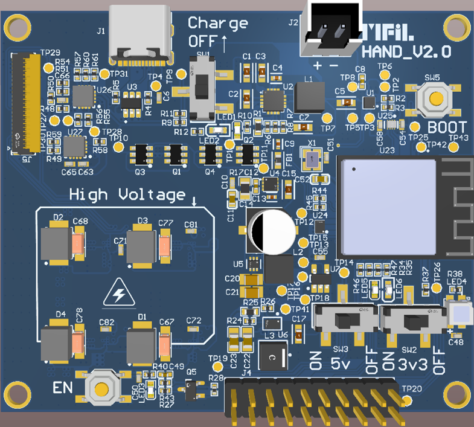
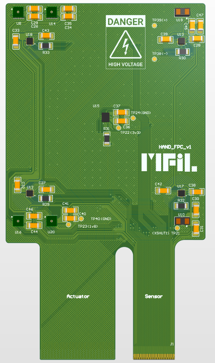
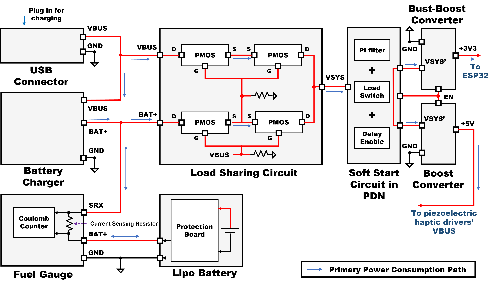
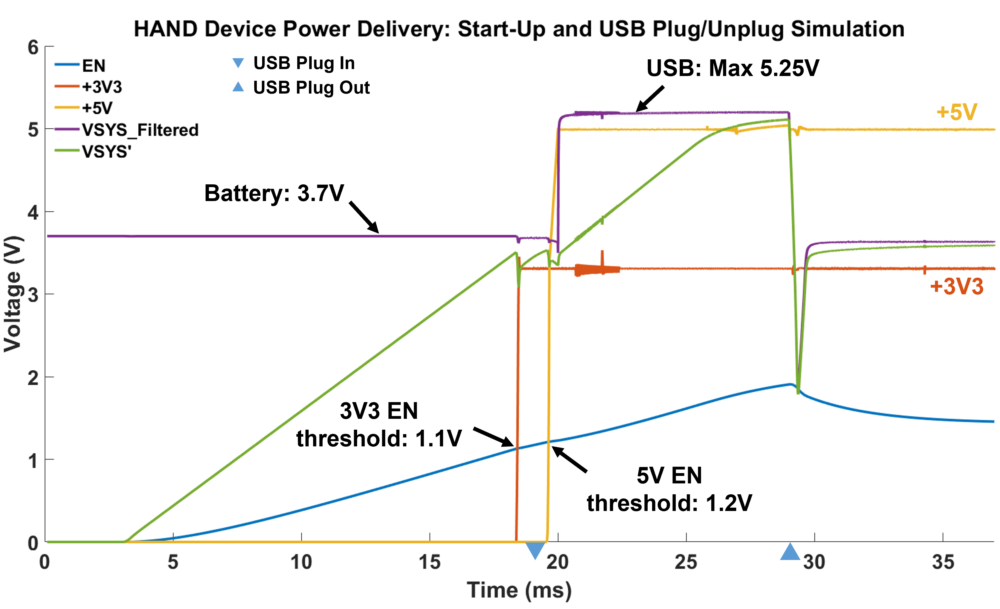

# HAND PCB

This repository collects all documents related to HAND PCB, which are divided into the main board and the sensor board (FPC).

## Software Requirements

- Altium Designer ≥ 2023

## Manufacturer

- [JLC](https://www.jlc.com)

## Appearance

|              main_board               |               sensor_board                |                  combination                  |
| :-----------------------------------: | :---------------------------------------: | :-------------------------------------------: |
|  |  |  |

It is worn on the user's hand back as shown below:

## PCB Parameters

- **main board**
  - 6-layer board
  - Internal copper thickness: 0.5 oz
  - External copper thickness: 1 oz
  - Minimum hole size: 0.15 mm
  - Final board thickness: 1.6 mm
  - Impedance control stackup model: [JLC06161H-3313](https://jlcpcb.com/impedance#:~:text=JLC06161H%2D3313%20Stackup)
- **sensor board**
  - 2-layer board
  - Final board thickness: 0.11 mm
  - External copper thickness: 1/3 oz
  - PI reinforcement: sensor side 0.1 mm / actuator side 0.225 mm
  - Covering film thickness: [PI] 12.5 μm / [AD] 15 μm

## Folder Structure

- `design_guide`: A PPT that explains the design details of HAND, including the PDN component selection, simulation parameters, precautions, etc.
- `pcb`: The PCB design files for HAND
  - `fabrication`: HAND’s Gerber (main_board only) and SMT stencil files.
  - `hand_main_board_v2`: The latest version of HAND main board PCB files.
  - `hand_sensor_origin_footprint_v1`: The latest version of HAND sensor board PCB files; this file should be submitted as an FPC for fabrication.
  - `pdf`: Contains layer layout, schematic, BOM, and other information for quick review.

## Power Delivery Network (PDN)

The PDN schematic of HAND is shown below:

I performed a power-up simulation of HAND's PDN using ORCAD, and the results are as follows:

The simulation results indicate that the main power rails(+3V3 and +5V) remain stable and unaffected by the connection or disconnection of a USB device.

Please refer to [hand_simulation](https://github.com/Dennis40816/hand_simulation) for the ORCAD files and settings, as well as the [configuration instructions](design_guide/HAND%20design%20guide.pptx).

## Precautions

- The `hand_ad_lib` for the main board and sensor board are **different**; please use the `hand_ad_lib` provided in the corresponding folder.
